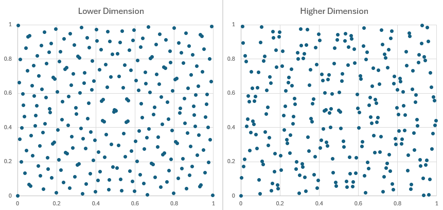
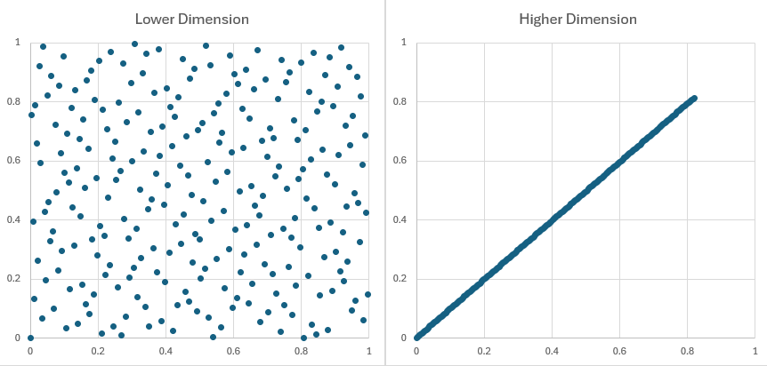
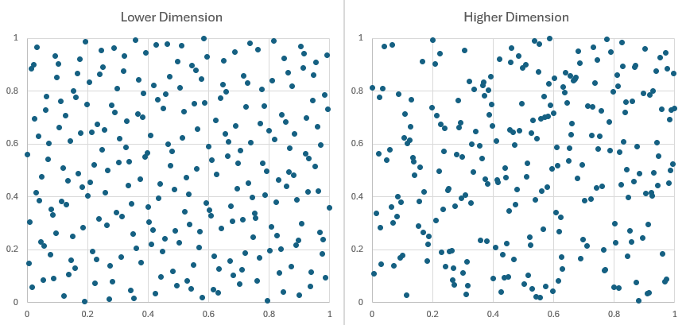
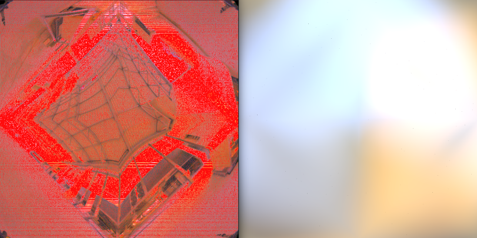

# rs-sampler

**256 Sampling resuts of samplers, lower dimension = 1st dimension, higher dimension = 64th dimension.**

## Sobol sampler

**No randomization**

**With Digit Permutaion randomization**

## Halton sampler

**No randomization**

**With Digit Permutaion randomization**

## Sampling environment light

