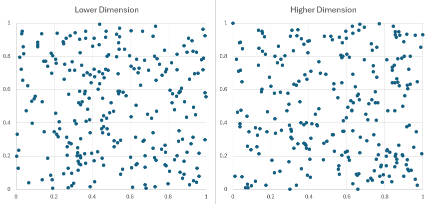
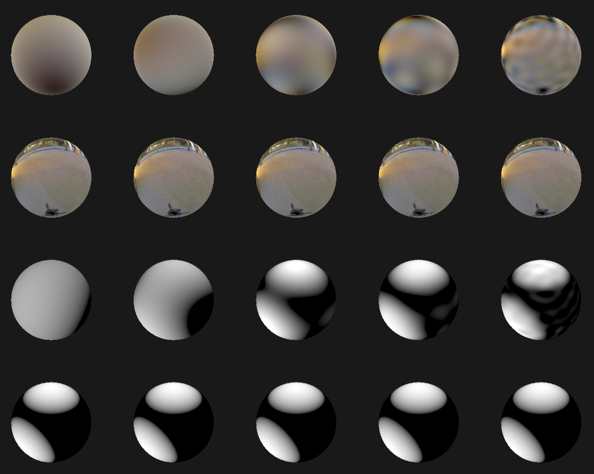

# rs-graphics

rs-graphics is a project that implements computer graphics alogrithms and tools.

## Samplers

lower dimension = 1st dimension, higher dimension = 64th dimension.

### Sobol sampler

No randomization

With Digit Permutaion randomization

### Halton sampler

No randomization

With Digit Permutaion randomization

## Environment light sampling 

## Spherical Harmonics

